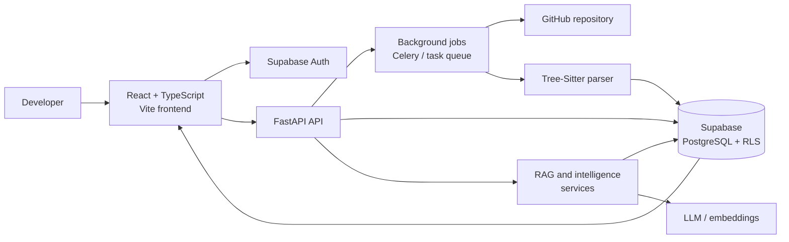
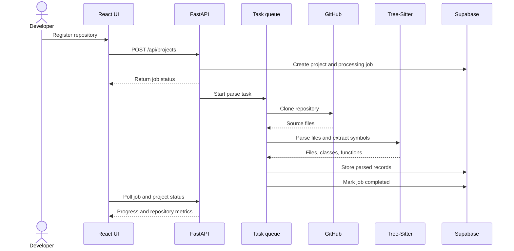
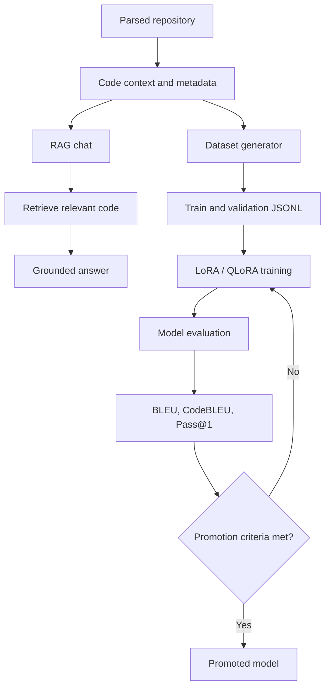

# 🎓 RepoTutor

**RepoTutor** is an end-to-end, repository-grounded AI platform for code comprehension, architecture visualization, RAG-assisted chat, fine-tuning dataset generation, and model evaluation.

---

## ✨ Features

| # | Feature | Description |
|---|---------|-------------|
| 1 | 📂 Repository Ingestion | Connect GitHub repos, track commits, languages & metadata |
| 2 | 🌳 AST Parsing | Multi-language Tree-Sitter parsing (Python, JS, TS, Java) |
| 3 | 🕸️ Architecture Visualizer | Interactive React Flow graph of files, functions & dependencies |
| 4 | 💬 RAG Chat | Grounded codebase Q&A with persisted chat threads |
| 5 | ⚡ Fine-Tuning Pipeline | Auto-generates JSONL datasets & runs LoRA/QLoRA training |
| 6 | 📊 Model Evaluation | BLEU, CodeBLEU, Pass@1 benchmarks with promotion criteria |

---

## 🛠️ Tech Stack


## 🗺️ System Architecture



## 🔄 Repository Ingestion



## 🤖 AI And Training Workflow



---

## 🚀 Getting Started

### Prerequisites
- Node.js v18+, Python v3.10+, Git, Supabase account

### 1. Database Setup
Run schema migrations in Supabase SQL Editor in order:
```
supabase_schema.sql → phase2 → phase3 → phase4 → phase5
```

### 2. Backend
```bash
cd backend
python -m venv venv && .\venv\Scripts\Activate.ps1
pip install -r requirements.txt
```
Create `backend/.env`:
```env
SUPABASE_URL=https://your-project.supabase.co
SUPABASE_KEY=your-key
GITHUB_TOKEN=your-token   # optional
```
```bash
uvicorn app.main:app --reload --port 8000
```

### 3. Frontend
```bash
cd frontend
npm install
```
Create `frontend/.env`:
```env
VITE_SUPABASE_URL=https://your-project.supabase.co
VITE_SUPABASE_ANON_KEY=your-anon-key
VITE_API_BASE_URL=http://localhost:8000
```
```bash
npm run dev
# → http://localhost:5173
```

---

## 🔌 API Endpoints

| Endpoint | Method | Description |
|----------|--------|-------------|
| `/api/health` | GET | Health check |
| `/api/projects` | GET / POST | List or register repositories |
| `/api/repositories/{id}/parse` | POST | Trigger AST parsing |
| `/api/projects/{id}/summary` | GET | Repo summary & metrics |
| `/api/chats/` | POST | RAG chat query |
| `/api/projects/{id}/datasets/generate` | POST | Generate fine-tuning dataset |
| `/api/projects/{id}/training/start` | POST | Launch LoRA training job |
| `/api/projects/{id}/training/jobs` | GET | Job status & progress |
| `/api/projects/{id}/evaluations` | GET / POST | Run or fetch evaluations |

---

## 📜 License

MIT License — open-source and free to use.
